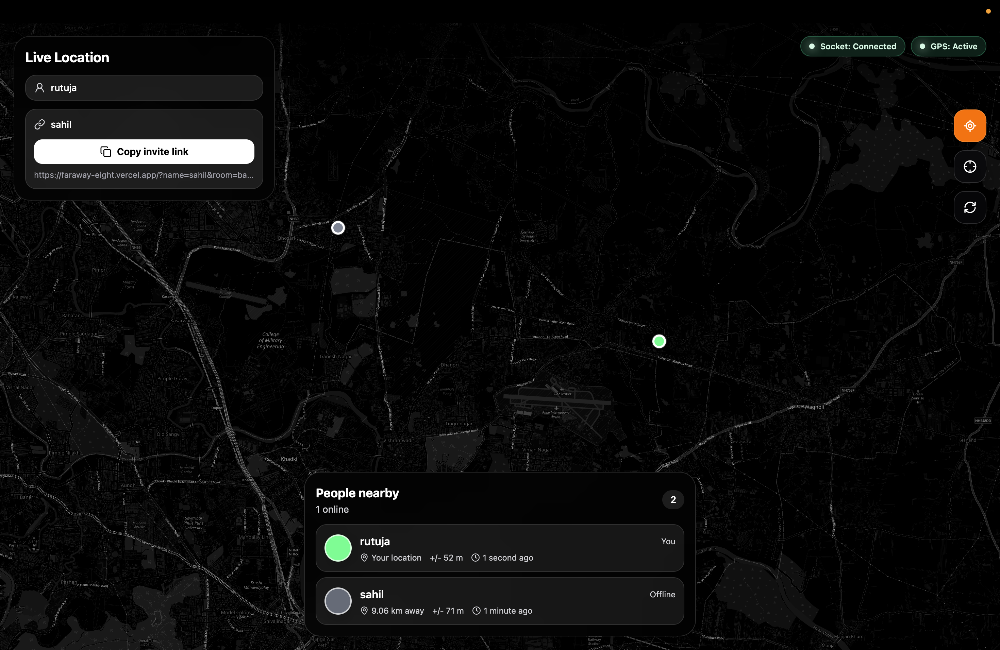

# Real-Time Tracker

A real-time location tracking application built with Node.js, Express.js, Socket.IO, and Leaflet.js. It allows multiple users to share and view live locations on an interactive map.

## Preview



## Features

- Live location tracking
- Real-time updates
- Interactive map
- Multi-user support
- Responsive UI

## Tech Stack

| Technology | |
|------------|----------------|
| Backend | Node.js, Express.js |
| Real-Time | Socket.IO |
| Maps | Leaflet.js |
| Frontend | HTML, CSS, JavaScript |

## Installation

```bash
git clone https://github.com/rutuja2005byte/Real-Time-Tracker.git
cd Real-Time-Tracker
npm install
node app.js
```

Open:

```
http://localhost:3000
```

## Project Structure

```
Real-Time-Tracker
├── public/
├── views/
├── app.js
├── package.json
├── img.png
└── README.md
```

## Author

**Rutuja Darade**

GitHub: https://github.com/rutuja2005byte